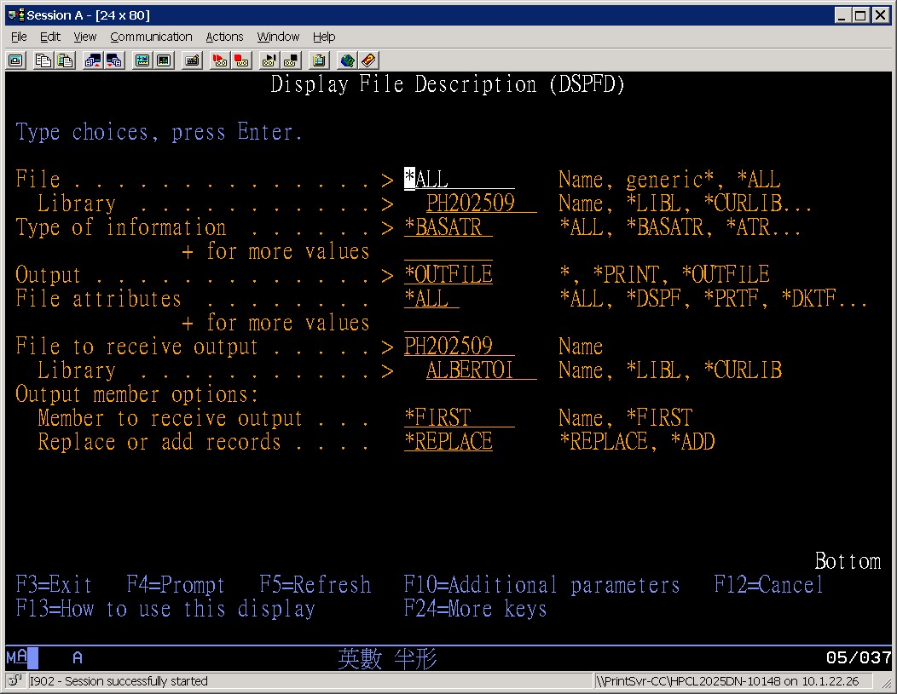
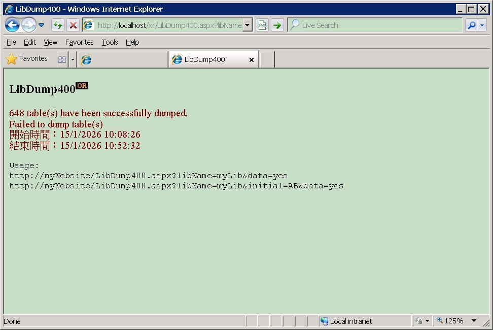

### The story behind PHLIB
> "The only attitude worthy of a superior man is to persist in an activity he recognizes is useless, to observe a discipline he knows is sterile, and to apply certain norms of philosophical and metaphysical thought that he considers utterly inconsequential" <br /><br />"A única atitude digna de um homem superior é o persistir tenaz de uma atividade que se reconhece inútil, o hábito de uma disciplina que se sabe estéril, e o uso fixo de normas de pensamento filosófico e metafísico cuja importância se sente ser nula."<br/>--- The Book of Disquiet by Fernando Pessoa


#### Prologue 
Furture is unknown, what we know so far is called *history*. To live is not to forget, to write is not to forget, idiots forget while geniuses forgive... I am here to pen down my opinionated story about **PHLIB**. To begin with, let's date back to 2012. 

At that time, We were using DB/400 on AS/400 as main platform and due to statistic requirement, a monthly snapshot was taken by copying production files into new library named PH*YYYYMM* at the end of each month, where YYYY is year, MM is month. In the year of 2017, a migration was planned from DB2/400 to Oracle. In the year of 2019, the **XRunner** project, which was written in ASP.NET 2.0 WebForm, rolled out with purpose of: 

1. Facilitates creation of tables in Oracle according to definition in DB2/400; 
2. Copies data from DB/400 to Oracle, this enables one-way synchronization on a scheduled base; 
3. Facilitates execution of SQL statements on both platforms; 
4. Dump tables from DB/400 in text suitable for Oracle import; 

Until 2025, the migration process has not finished but the target database was abandoned! And the new database is not known so much the worse... As of this writing, there are more than 8000 tables in snapshot... and this legacy data gets detained and stagnates and in a couple of years, AS/400 will fade out and [all those tables will be lost in time, like tears in the rain](https://www.reddit.com/r/QuotesPorn/comments/bn497r/all_those_moments_will_be_lost_in_time_like_tears/). 

My idea is to dump all out, convert them into general SQL syntax and feed them into a third party database, [SQLite](https://sqlite.org/) becomes the natural choice. 


#### I. Generate the SQL dump
To be honest, the whole process is quite complicated which involves: 
1. Gather meta info of tables from snapshot libraries; 

This requires running `DSPFD` command for each snapshot library in AS/400 command line. 
```
DSPFD FILE(PH202509/*ALL) TYPE(*BASATR) OUTPUT(*OUTFILE) OUTFILE(ALBERTOI/PH202509) 
```


2. Merging meta info repository; 

This requires running `INSERT INTO` statement for each snapshot library using whichever SQL client you prefer. 
```
insert into albertoi.phlibpf
( select * from albertoi.PH202509 )
```

3. Run **libDump** utility dump snapshot of a year;

This requires hosting XRunner and type in URL on browser: 
```
http://localhost/xr/LibDump400.aspx?libName=PH2026&data=yes
```


4. Convert SQL dump into general syntax;

This requires running `oracle-to-sqlite.js` with proper parameters:
```
node src/oracle-to-sqlite.js "H:\\PHLIB\\2025" "H:\\PHLIB.SQLITE\\2025"
```

5. Load all new SQL dump into SQLite;  

This requires running `loaddb.bat` with proper parameters:
```
loaddb.bat H:\PHLIB.db H:\PHLIB.SQLITE\2026
```

Repeat point 4 and 5 until snapshot libraries exhaust. When it is dont, the snapshots can be queried with ease: 


#### II. Full rundown for 2026.
1. 
```
DSPFD FILE(PH202601/*ALL) TYPE(*BASATR) OUTPUT(*OUTFILE) OUTFILE(ALBERTOI/PH202601) 
DSPFD FILE(PH202602/*ALL) TYPE(*BASATR) OUTPUT(*OUTFILE) OUTFILE(ALBERTOI/PH202602) 
DSPFD FILE(PH202603/*ALL) TYPE(*BASATR) OUTPUT(*OUTFILE) OUTFILE(ALBERTOI/PH202603) 
DSPFD FILE(PH202604/*ALL) TYPE(*BASATR) OUTPUT(*OUTFILE) OUTFILE(ALBERTOI/PH202604) 
DSPFD FILE(PH202605/*ALL) TYPE(*BASATR) OUTPUT(*OUTFILE) OUTFILE(ALBERTOI/PH202605) 
DSPFD FILE(PH202606/*ALL) TYPE(*BASATR) OUTPUT(*OUTFILE) OUTFILE(ALBERTOI/PH202606) 
DSPFD FILE(PH202607/*ALL) TYPE(*BASATR) OUTPUT(*OUTFILE) OUTFILE(ALBERTOI/PH202607) 
DSPFD FILE(PH202608/*ALL) TYPE(*BASATR) OUTPUT(*OUTFILE) OUTFILE(ALBERTOI/PH202608) 
DSPFD FILE(PH202609/*ALL) TYPE(*BASATR) OUTPUT(*OUTFILE) OUTFILE(ALBERTOI/PH202601) 
DSPFD FILE(PH202610/*ALL) TYPE(*BASATR) OUTPUT(*OUTFILE) OUTFILE(ALBERTOI/PH202610) 
DSPFD FILE(PH202611/*ALL) TYPE(*BASATR) OUTPUT(*OUTFILE) OUTFILE(ALBERTOI/PH202611) 
DSPFD FILE(PH202612/*ALL) TYPE(*BASATR) OUTPUT(*OUTFILE) OUTFILE(ALBERTOI/PH202612) 
```

2. 
```
insert into albertoi.phlibpf
( 
    select * from albertoi.PH202601 union 
    select * from albertoi.PH202602 union 
    select * from albertoi.PH202603 union 
    select * from albertoi.PH202604 union 
    select * from albertoi.PH202605 union 
    select * from albertoi.PH202606 union 
    select * from albertoi.PH202607 union 
    select * from albertoi.PH202608 union 
    select * from albertoi.PH202609 union 
    select * from albertoi.PH202610 union 
    select * from albertoi.PH202611 union 
    select * from albertoi.PH202612
)
```

3. 
```
http://localhost/xr/LibDump400.aspx?libName=PH2026&data=yes
```

4. 
```
node src/oracle-to-sqlite.js "H:\\PHLIB\\2026" "H:\\PHLIB.SQLITE\\2026"
```

5. 
```
loaddb.bat H:\PHLIB.db H:\PHLIB.SQLITE\2026
```


#### III. Bibliography 
1. [SQLite Is ULTIMATE Choice For 99% of Projects](https://youtu.be/9RArbqGOvsw)
2. [The Book of Disquiet by Fernando Pessoa](https://dn720004.ca.archive.org/0/items/english-collections-1/Book%20of%20Disquiet%2C%20The%20-%20Fernando%20Pessoa.pdf)


#### Epilogue 
In SQLite, “files” don’t exist inside the database — everything is stored in a single `.db` file. What you *can* calculate are:
1. **Number of schema objects** (tables, indexes, views, triggers) — this is the closest analogue to “number of files.”
2. **Total database file size in GB** — using page size × page count.
Here are two SQL snippets you can run directly in SQLite:

1️⃣ Calculate number of “files” (schema objects
```
-- Count all objects in the database schema
SELECT type, COUNT(*) AS object_count
FROM sqlite_master
GROUP BY type;
```
This will return counts for `table`, `index`, `view`, and `trigger`.

2️⃣ Calculate total database size in GB
```
-- Compute database file size in gigabytes
SELECT ROUND((page_count * page_size) / (1024.0 * 1024 * 1024), 3) AS size_gb
FROM pragma_page_count(), pragma_page_size();
```
• `page_size` = bytes per page
• `page_count` = number of pages
• Multiply them for total bytes, then divide by `1024^3` to convert to GB.
• `ROUND(...3)` gives you precision to 3 decimal places.

✨ Together, these queries let you see both how many schema objects exist and how large the database file is on disk


### EOF (2026/01/30)
