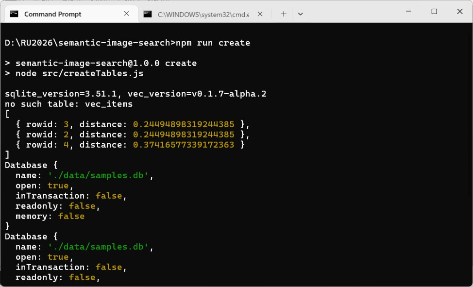
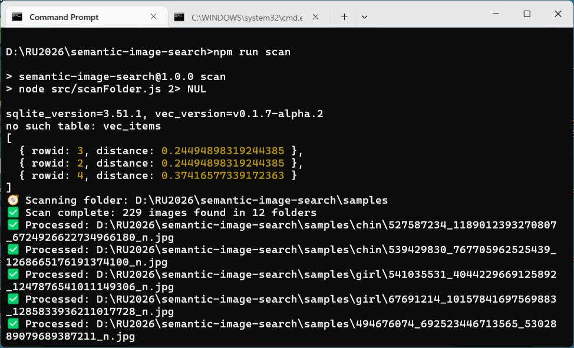
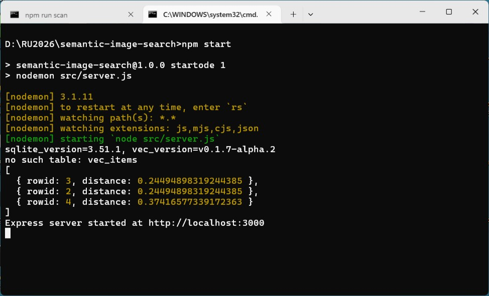
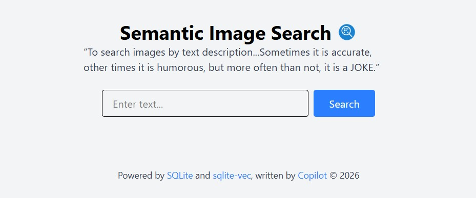
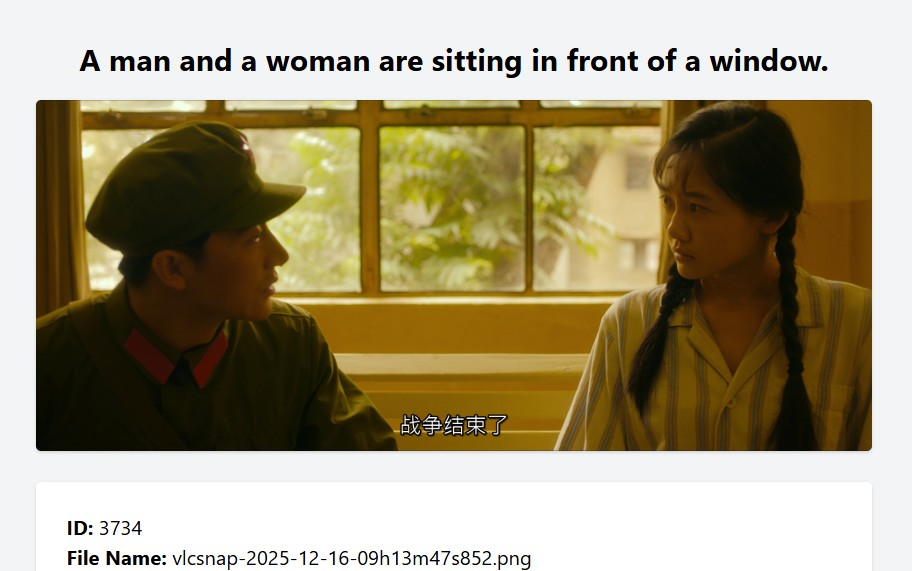
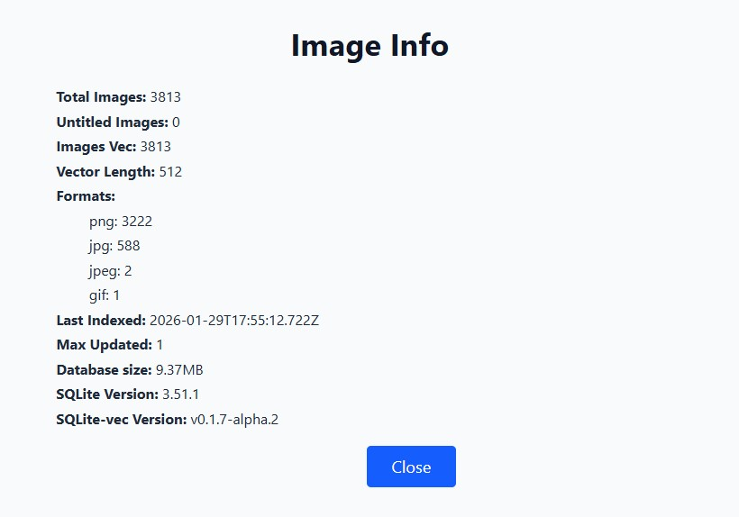

### Semantic Image Search
> "Every struggle, no matter what its goal, is forced by life to make
adjustments; it becomes a different struggle, serves different ends,
and sometimes accomplishes the very opposite of what it set out to
do. *Only slight goals are worth pursuing, because only a slight goal
can be entirely fulfilled.* "<br /><br />"Todo esforço, qualquer que seja o fim para que tenda, sofre, ao manifestar-se, os desvios que a vida lhe impõe; torna-se outro esforço, serve outros fins, consuma por vezes o mesmo contrário do que pretendera realizar. *Só um baixo fim vale a pena, porque só um baixo fim se pode inteiramente efetuar.*"<br/>--- The Book of Disquiet by Fernando Pessoa


#### Prologue
In the year of 2026, when "[AI slop](https://techcrunch.com/2026/01/05/microsofts-nadella-wants-us-to-stop-thinking-of-ai-as-slop/)" and "[Microslop](https://cybernews.com/ai-news/microsoft-ai-microslop-copilot/?utm_source=cn_facebook&utm_medium=social&utm_campaign=cybernews&utm_content=post&source=cn_facebook&medium=social&campaign=cybernews&content=post)" become internet buzzwords, all these impose introspection to what AI can do for human being. While most AI concept *stagnate* on fancy stage, the technique that prevails is *AI features* like  **semantic search**. 


#### I. Simplicity over functionality
The key to [semantic search](https://en.wikipedia.org/wiki/Semantic_search) is generation of vector embedding and calculation of vector distance. While most people can't afford to buy [NVIDIA](https://www.nvidia.com/zh-tw/) GPU but still feel the taste of semantic search. Tools are deliberately chosen in an effort to deliver decent performance even though running on moderate to low-end notebook comp;uters. 

- [SQLite](https://sqlite.org/): zero-configuration database engine. 
- [@xenova/transformers](https://www.npmjs.com/package/@xenova/transformers): model are downloaded and cached automatically.


#### II. Project Setup
1. Clone the [repo](https://github.com/Albert0i/semantic-image-search.git): 
```
git clone https://github.com/Albert0i/semantic-image-search.git
```

2. Install packages: 
```
cd semantic-image-search

npm install 
```

3. create an `.env` file: 
```
MODEL_ID=Xenova/clip-vit-base-patch16
DB_PATH='./data/samples.db'
PORT=3000
MAX_RETURN=100
```

4. Create tables in SQLite: 
```
npm run create
```


5. Scan your image folder: 
```
npm run scan -- "C:\\MyPhotos"
```


6. Optionally, add *title* to images: 
```
npm run cont 
```

7. Start the server: 
```
npm start 
```


8. Navigate to [http://localhost:3000/](http://localhost:3000/) and have fun... 







#### III.  Insider's View
This is a canonical [Node.js](https://nodejs.org/en) + [Express](https://expressjs.com/) + [EJS](https://ejs.co/) project featuring [tailwindcss](https://tailwindcss.com/). Backend API route `api.js` serves the following endpoints: 

```
GET /api/v1/info/:id 
GET /api/v1/embed/:id 
GET /api/v1/image/:id 
GET /api/v1/preview/:id 
POST /api/v1/search
GET /api/v1/info
```

Frontend route `home.js` serves the following endpoints:  
```
GET /
GET /image/:id
GET /info
```

Due to limitation of [sqlite-vec](https://github.com/asg017/sqlite-vec), two separate tables are needed to store image information: 
```
CREATE TABLE images (
    id INTEGER PRIMARY KEY AUTOINCREMENT,
    fileName VARCHAR(255) NOT NULL,
    title TEXT NOT NULL DEFAULT '', 
    fullPath VARCHAR(255) NOT NULL,
    fileFormat VARCHAR(16) NOT NULL,
    fileSize INTEGER NOT NULL,      
    hash CHAR(64) NOT NULL DEFAULT '',
    indexedAt VARCHAR(24) NOT NULL,
    createdAt VARCHAR(24) NOT NULL,
    modifiedAt VARCHAR(24) NOT NULL,
    updateIdent INTEGER NOT NULL DEFAULT 0,
    UNIQUE(fullPath)
);
```

And the embedding of images: 
```
CREATE VIRTUAL TABLE images_vec USING vec0 (
        embedding float[512]
    );
```
Care should be taken if you use a different model, `embedding float[512]` has to be modified accordingly. 

To query for [k-nearest](https://en.wikipedia.org/wiki/K-nearest_neighbors_algorithm) vectors: 
```
SELECT rowid, distance
    FROM images_vec
    WHERE embedding MATCH ?
    ORDER BY distance ASC
    LIMIT ?;
```

Model `Xenova/clip-vit-base-patch16` is used to generate both image and text embedding in `embedder.js`: 
```
import 'dotenv/config'
import { AutoTokenizer, CLIPTextModelWithProjection } from "@xenova/transformers";
import { AutoProcessor, RawImage, CLIPVisionModelWithProjection } from '@xenova/transformers';

// Load processor and vision model
export const model_id = process.env.MODEL_ID

// Load tokenizer and text model
const tokenizer = await AutoTokenizer.from_pretrained(model_id);
const text_model = await CLIPTextModelWithProjection.from_pretrained(model_id);

// Load processor and vision model
const processor = await AutoProcessor.from_pretrained(model_id);
const vision_model = await CLIPVisionModelWithProjection.from_pretrained(model_id, {
    quantized: false,
});

export async function getTextEmbeds(text) {
   // Run tokenization
   const text_inputs = tokenizer(text, { padding: true, truncation: true });

   // Compute embeddings
   const { text_embeds } = await text_model(text_inputs);
   
   return text_embeds
}

export async function getImageEmbeds(image_url) { 
   // Read image
   const image = await RawImage.read(image_url);

   // Run processor
   const image_inputs = await processor(image);

   // Compute embeddings
   const { image_embeds } = await vision_model(image_inputs);

   return image_embeds
}
```

Another model `Xenova/vit-gpt2-image-captioning` is used to grab caption from an image in `captioner/js`: 
```
import { pipeline } from '@xenova/transformers';

const captioner = await pipeline(
   'image-to-text', 
   'Xenova/vit-gpt2-image-captioning'
   );

export async function getImageCaption(image_url) { 
    const output = await captioner(image_url);

   return output
}
```


#### IV. Summary 
Generation of vector embedding is a time-consuming process. It may take hours or days to complete depending on number of images. A typical modern user has more than 10,000 photos which is not uncommon. To alleviate the situation, both `npm run scan` and `npm run cont` can be run multiple times. You can just terminate the `scan/cont` process by pressing `Ctrl-C`, next time when you run the same command, it will resume from where you leave and contine the generation. 

Following the same procedure, multiple folders of image can be fed into the database. In case you mess up everything, just run `npm run create` to wipe off everything and restart from the very beginning. 


#### V. Bibliography 
1. [SQLite Is ULTIMATE Choice For 99% of Projects](https://youtu.be/9RArbqGOvsw)
2. [This SQLite Fork is SO GOOD (and it’s open source)](https://youtu.be/CrIkUwo8FiY)
3. [SQLite](https://sqlite.org/)
4. [sqlite-vec](https://github.com/asg017/sqlite-vec)
5. [transformers.js](https://github.com/huggingface/transformers.js)
6. [Hugging Face](https://huggingface.co/)
7. [ServiceStack/images](https://github.com/ServiceStack/images)
8. [Setting up Express MVC + EJS + TailwindCSS (4.0)](https://medium.com/@hannnirin/setting-up-express-mvc-ejs-tailwindcss-4-0-2ccac72dad59)
9. [The Book of Disquiet by Fernando Pessoa](https://dn720004.ca.archive.org/0/items/english-collections-1/Book%20of%20Disquiet%2C%20The%20-%20Fernando%20Pessoa.pdf)


#### Epilogue 
Just for your information, models are cached in: 
```
./node_modules/@xenova.transformers/.cache/Xenova
```

“To search images by text description...Sometimes it is accurate, other times it is humorous, but more often than not, it is a JOKE.”


### EOF (2026/01/30)